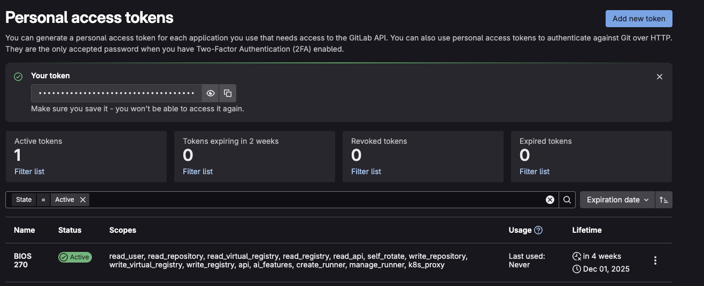
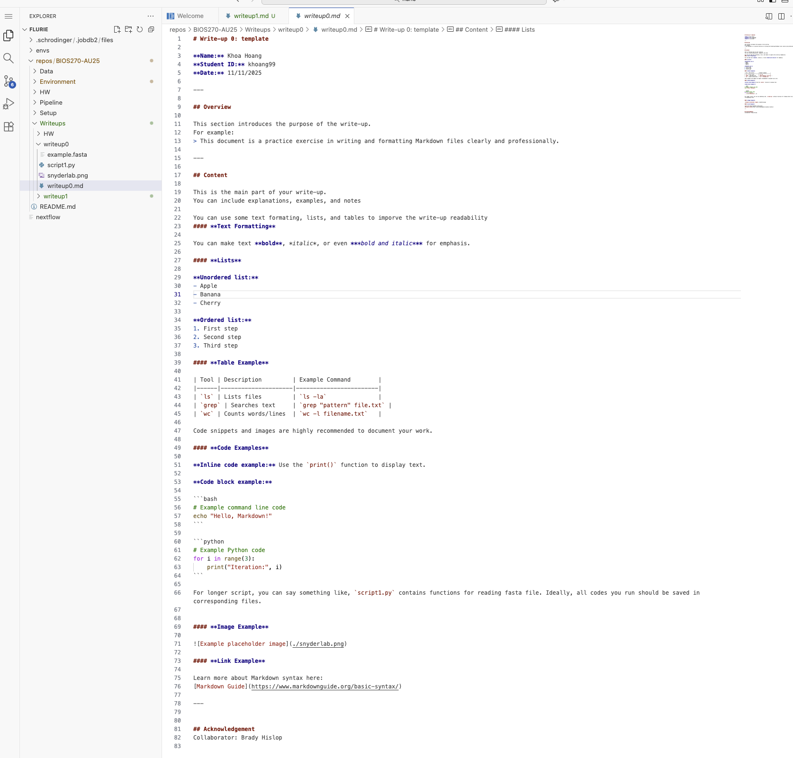

# Write-up 2: Environment

**Name:** Franklin Lurie
**Student ID:** flurie
**Date:** 11/13/2025  

---

## 1. Micromamba
I created and activated the micromamba environment:


I found and ran both test scripts (the pyton one did not produce a command-line output for me):


`python_example.py`output plot:


`r_example.R` output plot:


I successfully installed `rpy2` and exported the new environment:


Compared to the original environment, the main new change I notice from the above is that rpy2 is now installed!


Micromamba helpful commands:
- List all created environments:
```bash
micromamba env list
# or
micromamba info --envs
```

- List all packages installed in a specific environment
```bash
micromamba list -n bioinfo_example
#or, if the environment is already activated:
micromamba list
```

- Remove a package
```bash
remove package_name
```

- Install a package from a specific channel
```bash
micromamba install -c channel_name package_name
```

- Remove an environment
```bash
micromamba env remove -n bioinfo_example
```

- What are all the `r-base` and `Bioconductor` packages that were installed in the `bioinfo_example` environment? (Hint: You may want to use one of the commands from your answers to the above questions, and combine it with the grep command.)
Using the command `micromamba list | grep " r-"` (the grep command `"^r-"` fails because `list` uses whitespaces), I get the following list of 204 items:


Using the command `micromamba list | grep "bioconductor-"`, I get the following list of 18 items:


---

## 2. Container

1. I logged in to Docker in my terminal:


and to Stanford GitLab through Farmshare:

(I had to create a new token first, but I did this successfully!):


2. I was able to successfully build my own Docker image locally, which I then pushed to DockerHub, and then tagged and pushed to Stanford GitLab:


3. I was then able to pull my doecker image from Stanford GitLab into farmshare:


I then wrote a Python script to print "Hello World" and tried to run it through my container, but got a "no file or directory" error:


As hinted to, this is because I did not use the -B flag when I tried to run the script, which would bind the path to my Python file into the conatiner so that it could be run. According to the Apptainer documentation, this is because the an Apptainer container has its own directory structure, and so it cannot access files outside of its own directories unless they are bound using the -B or --bind flag! Source: https://apptainer.org/docs/user/main/bind_paths_and_mounts.html

4. **I could not figure out how to do this part of the exercise!**

5. I successfully pulled this more advanced container from Stanford GitLab:


6. Run code-server through SSH tunneling:
I did this in OH with Khoa on 11/20/2025! Here is my SSH login and running code-server:


---

## Acknowledgement
Collaborator: Ginny Paparcen
